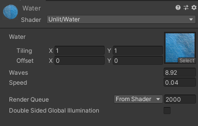

# Unity Water Shader

This is a simple water shader you can use to make a distant water effect or ocean that performs well.

It is extremely cheap to render. The shader is unlit, and will not have lighting effects applied to it.

I wrote it as a little shader exercise, so its not perfect by any means but it gets the job done.

## What is included?

 - Water Material
 - Water Shader
 - Example Scene
 - Water Prefab

### Note:

You can customize the wave speed and intensity by playing around with the material settings. Just select the material in the project and edit it in the inspector.

